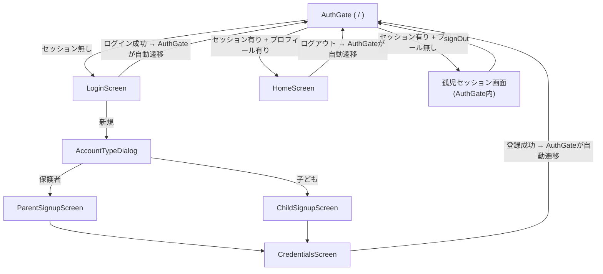

# ログイン仕様書 (Flutter × Supabase Auth)

このドキュメントは認証まわりの実装([lib/screens/](../lib/screens/)、[lib/services/auth_service.dart](../lib/services/auth_service.dart)など)の仕様書です。
**コードが正**であり、このドキュメントはそれを読み解くための資料です。実装を変更したら、このドキュメントも合わせて更新してください。

DBスキーマ・RPCの詳細は [db_schema.md](db_schema.md) を参照。

## 目次

- [設計方針](#設計方針)
- [画面と遷移](#画面と遷移)
- [認証状態の管理(AuthGate)](#認証状態の管理authgate)
- [ログインフロー](#ログインフロー)
- [新規登録フロー](#新規登録フロー)
- [孤児セッションのリカバリ](#孤児セッションのリカバリ)
- [エラーメッセージ](#エラーメッセージ)
- [環境設定](#環境設定)
- [テストアカウント](#テストアカウント)
- [既知の制約](#既知の制約)

---

## 設計方針

| # | 方針 | 理由 |
|---|---|---|
| 1 | 状態管理ライブラリは使わず、`Supabase.instance.client` を薄い `AuthService` で包む | ハッカソン規模でProvider/Riverpodを導入するコストに見合わない |
| 2 | 画面遷移は各画面が能動的に行わず、`AuthGate` が `onAuthStateChange` を見て自動で切り替える | ログイン成功/失敗、ログアウト、セッション復元をすべて1箇所に集約できる |
| 3 | プロフィール作成はRPC(`create_parent_account` / `join_group`)経由のみ。クライアントからの直接INSERTは行わない | `profiles`にINSERTポリシーがなく、RLS上そもそも直接INSERTは失敗する。グループコード発行や重複登録チェックをサーバー側に集約するため |
| 4 | `signUp`成功後に RPC が失敗したら即座に `signOut` する | メール確認オフの構成(必須。「新規登録フロー」冒頭を参照)では signUp 直後にセッションが張られる。RPC失敗のまま放置すると「ログイン済みだがプロフィールが無い」孤児セッションになるため、その場で解消する |

### 用語

- **孤児セッション** … `auth.users` にアカウントは存在するが、対応する `profiles` 行が無い状態。signUpとRPCの非アトミック性により発生しうる。
- **グループコード** … 親アカウント作成時にサーバー(`create_parent_account`)が発行する4桁コード。子はこれを使って `join_group` する。

---

## 画面と遷移

| 画面 | ファイル | 役割 |
|---|---|---|
| AuthGate | [auth_gate.dart](../lib/screens/auth_gate.dart) | ルート`/`。セッション有無とプロフィール有無を見て次の画面を出し分ける |
| LoginScreen | [login_screen.dart](../lib/screens/login_screen.dart) | メール/パスワードログイン、テストログイン、新規登録への入口 |
| AccountTypeDialog | [account_type_dialog.dart](../lib/screens/account_type_dialog.dart) | 親/子どちらのアカウントを作るか選択するダイアログ |
| ParentSignupScreen | [parent_signup_screen.dart](../lib/screens/parent_signup_screen.dart) | 親側: ユーザー名・グループ名を入力 |
| ChildSignupScreen | [child_signup_screen.dart](../lib/screens/child_signup_screen.dart) | 子側: ユーザー名・グループコードを入力 |
| CredentialsScreen | [credentials_screen.dart](../lib/screens/credentials_screen.dart) | 共通の最終ステップ: メール/パスワードを登録し、signUp + RPCを実行 |
| HomeScreen | [home_screen.dart](../lib/screens/home_screen.dart) | ログイン後のプレースホルダー画面。ログアウトボタンを持つ |
| MissingConfigScreen | [missing_config_screen.dart](../lib/screens/missing_config_screen.dart) | `.env`未設定時に表示される設定案内画面 |



---

## 認証状態の管理(AuthGate)

[auth_gate.dart](../lib/screens/auth_gate.dart) がルート`/`に置かれ、`AuthService.onAuthStateChange`(`StreamBuilder`)を監視する。

1. **セッション無し** → `LoginScreen`
2. **セッション有り** → `AuthService.fetchProfile()` の結果で分岐(`FutureBuilder`)
   - 取得中 → ローディング表示
   - 取得失敗(通信エラー等) → 「通信に失敗しました」+ 再試行ボタン。**ここではsignOutしない**(一時的な通信断とプロフィール不在を混同しないため)
   - `null`(=プロフィール行が無い、孤児セッション) → 案内文 + 「ログイン画面に戻る」ボタン(押すと`signOut`)
   - 取得成功 → `HomeScreen(profile: ...)`

`AuthService.profileRevision`(`ValueNotifier<int>`)は、RPCでプロフィールを作成した直後に`AuthGate`へ再取得を促すためのシグナル。`ValueListenableBuilder`のkeyに使い、`FutureBuilder`をやり直させている。

**ホットリロードでは`main()`が再実行されないため`Supabase.initialize`が走らない。** 認証まわりの動作確認は必ずホットリスタート(または完全な再起動)で行うこと。

---

## ログインフロー

[login_screen.dart](../lib/screens/login_screen.dart)

1. メール形式(`validateEmail`)とパスワード非空をローカルでチェック
2. `AuthService.signIn(email, password)` → `signInWithPassword` を呼ぶ
3. 成功時は画面側で何もしない。`AuthGate`がセッション変化を検知して自動的に`HomeScreen`へ切り替える
4. 失敗時は `authErrorMessage` で日本語化したメッセージをフォーム下に表示

テストログインボタン3つ(保護者/子供1/子供2)は、[supabase_config.dart](../lib/supabase_config.dart)に定義した固定メールアドレスと共通パスワードで同じ`signIn`処理を呼ぶ。**事前にその3アカウントが実際にSupabase上へ登録されている必要がある**(→[テストアカウント](#テストアカウント))。

---

## 新規登録フロー

> **前提: Supabaseプロジェクト側で「Confirm email」をOFFにしておくこと。**
> `supabase/config.toml`の`enable_confirmations = false`は**ローカルスタック専用**で、ホスト側プロジェクトには反映されない(ダッシュボード → Authentication → Providers → Email、または`supabase link`後の`supabase config push`)。
> ONのままだと`signUp`がセッションを返さず、直後のRPCが`anon`として実行され`auth.uid()`がNULLになり、`groups.created_by`のNOT NULL違反(23502)で新規登録が必ず失敗する。現在は`AuthService.signUp`が`session != null`を返し、`CredentialsScreen`がRPCを呼ぶ前にこの状態を検知して案内文を出す。

サインアップは3画面(親/子どちらかの入力画面 → CredentialsScreen)にまたがり、[signup_draft.dart](../lib/models/signup_draft.dart)の`SignupDraft`が入力値を運ぶ。**アカウント自体を作るのはCredentialsScreenのみ**。

### 親の場合

1. `ParentSignupScreen`: ユーザー名・グループ名を入力。**この時点ではグループコードは存在しない**(旧実装ではクライアント側でダミーコードを生成していたが廃止済み)
2. `CredentialsScreen`でメール/パスワードを入力し「決定」
3. `AuthService.signUp` → 成功後 `AuthService.createParentAccount(groupName, displayName)` を呼び、`create_parent_account` RPCが実際のグループコードを発行
4. 発行されたコードをダイアログで表示(お子さまの登録に必要な旨を案内)
5. ダイアログを閉じると`popUntil(isFirst)`で`AuthGate`まで戻り、`HomeScreen`が表示される

### 子の場合

1. `ChildSignupScreen`: ユーザー名・4桁のグループコードを入力
2. `CredentialsScreen`でメール/パスワードを入力し「決定」
3. `AuthService.signUp` → 成功後 `AuthService.joinGroup(code, displayName)` を呼び、`join_group` RPCが該当グループに`profiles`行を作成

**グループコードの事前検証はできない。** `groups`テーブルのRLSはプロフィール保持者の自グループ参照のみ許可しており、プロフィール未作成のユーザーは`groups`を一切SELECTできない。そのため不正なコードは`join_group`実行時(＝サインアップの最終ステップ)で初めて判明する。誤りがあった場合はエラー表示後、ユーザーが前の画面に戻ってコードを打ち直す。

---

## 孤児セッションのリカバリ

`signUp`とプロフィール作成RPCはアトミックではない。`CredentialsScreen`の処理順序は以下:

```
signUp() ─┬─ 失敗 → その場でエラー表示(セッションは作られていないので後始末不要)
          └─ 成功 → RPC実行 ─┬─ 失敗 → signOut() してからエラー表示
                              └─ 成功 → popUntil(isFirst) → AuthGateへ
```

RPC失敗時に`signOut`することで、「ログイン済みだがプロフィールが無い」状態がアプリ内に残らないようにしている。ただし**Supabase Auth上のユーザー自体は残る**(anon keyではユーザー削除不可)。そのため同じメールアドレスでの再登録は「既に登録されています」エラーになる。再試行する場合は別のメールアドレスを使うか、Supabaseダッシュボードから該当ユーザーを削除する。

アプリ再起動などでこの状態のセッションが復元された場合は、`AuthGate`が`fetchProfile()`の結果`null`を検知し、[孤児セッション画面](#認証状態の管理authgate)を表示する。

---

## エラーメッセージ

[auth_errors.dart](../lib/utils/auth_errors.dart) の `authErrorMessage(Object error)` が、Supabaseの例外を日本語メッセージに変換する。

| 例外の種類 / メッセージの特徴 | 表示文言 |
|---|---|
| `AuthException`: `Invalid login credentials` | メールアドレスまたはパスワードが正しくありません |
| `AuthException`: `already registered` | このメールアドレスは既に登録されています |
| `AuthException`: `Password should be at least` | パスワードは6文字以上で入力してください |
| `AuthException`: `is invalid`(メール形式) | メールアドレスの形式が正しくありません |
| `AuthException`: `rate limit` | しばらく待ってから再度お試しください |
| `AuthException`: その他 | ログインに失敗しました |
| `AuthRetryableFetchException` | 通信に失敗しました。接続を確認してください |
| `PostgrestException`: `No group found for code` | グループコードが見つかりません |
| `PostgrestException`: `already has a profile` | このアカウントは既に登録済みです |
| `PostgrestException`: その他 | 登録に失敗しました。時間をおいて再度お試しください |
| `SocketException` / `Failed host lookup` / `ClientException` | 通信に失敗しました。接続を確認してください |
| 上記以外 | エラーが発生しました |

---

## 環境設定

Supabaseの接続情報はソースに埋め込まず、プロジェクト直下の`.env`から[flutter_dotenv](https://pub.dev/packages/flutter_dotenv)で読み込む([supabase_config.dart](../lib/supabase_config.dart))。

```
SUPABASE_URL=https://<project-ref>.supabase.co
SUPABASE_ANON_KEY=<anon key>
TEST_PASSWORD=test1234   # 省略可。テストログイン3ボタン共通のパスワード
```

- `.env.example` をコピーして `.env` を作成する。`.env` は `.gitignore` 対象でコミットされない
- `pubspec.yaml` の `assets` に `.env` を登録しているため、`.env`が無い状態でビルドすると警告が出る(実行時は`main()`内で`dotenv.load()`の例外を握り、[MissingConfigScreen](../lib/screens/missing_config_screen.dart)を表示する)
- **ホットリロードでは環境変数の再読み込み・Supabase再初期化は行われない。** `.env`を変更したら必ずホットリスタートすること

---

## テストアカウント

anon keyではSupabase側のユーザーを直接作成できないため、**アプリのUIから一度だけ本登録して用意する**。

1. `parent@example.com` / `.env`の`TEST_PASSWORD`(既定値`test1234`) / グループ名は任意(例:「テスト家族」)で親登録し、発行されたグループコードを控える
2. ログアウト後、`child1@example.com`・`child2@example.com`を、控えたコードで子登録する

以降はログイン画面の3つのテストボタンがそのまま使える。`supabase/seed.sql`はローカル`db reset`専用で、デプロイ済みプロジェクトのシードには使えない。

---

## 既知の制約

- グループコードの事前重複・存在チェックがクライアント側にできない(前述の通りRLSの都合)
- 孤児セッションになった際、Supabase Auth上のユーザー自体は残り続ける(手動削除が必要)
- パスワードリセット・メール確認・ソーシャルログインは未実装
- ロール(`parent`/`child`)や表示名の変更、退会機能は未実装
